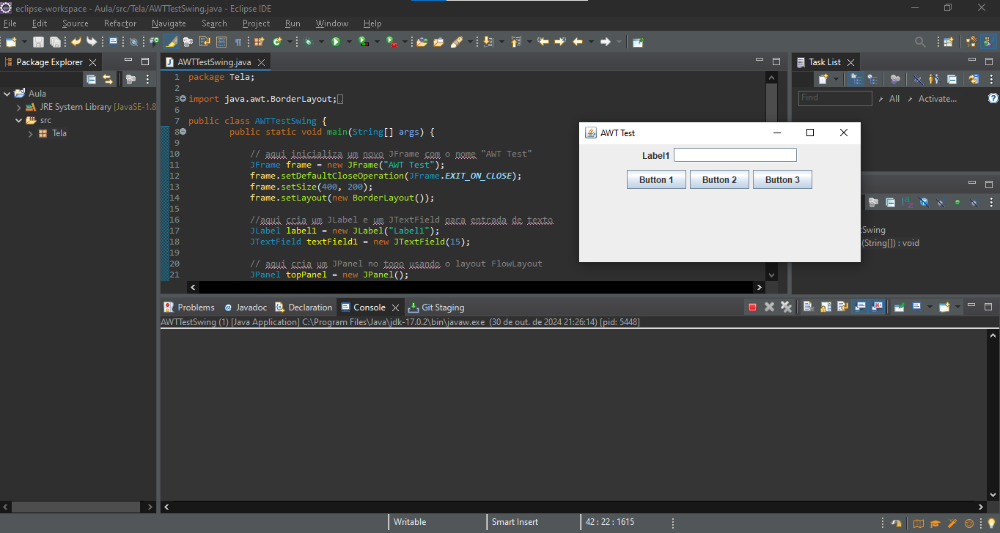

# Modelo Tela

## 🚀 Começando

* ETAPA 1

* CRIE UM PROJETO EM JAVA E REPRODUZA O EXEMPLO DO SLIDE ANTERIOR;

* CONFIRA SE O MESMO ESTÁ FUNCIONANDO;

* COMENTE O CÓDIGO ESCRITO DEMONSTRANDO SEUS CONHECIMENTOS SOBRE O ITEM;

* CRIE UM REPOSITÓRIO REMOTO E NOMEIE COM MODELO_TELA;

## 🛠️ Construído com

* IDE Eclipse

## 📌 Versão

* Versão 1.0

## ✒️ Autores

* Nicolas Beloto Armenio - Modelo Tela
